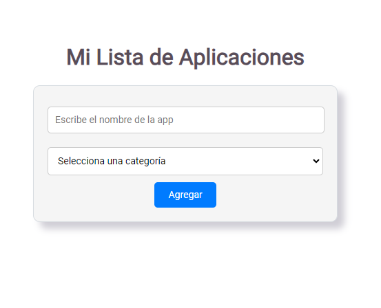
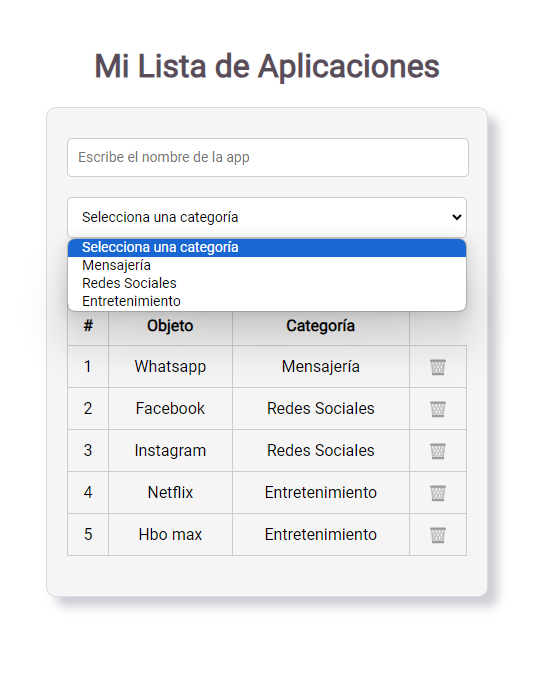
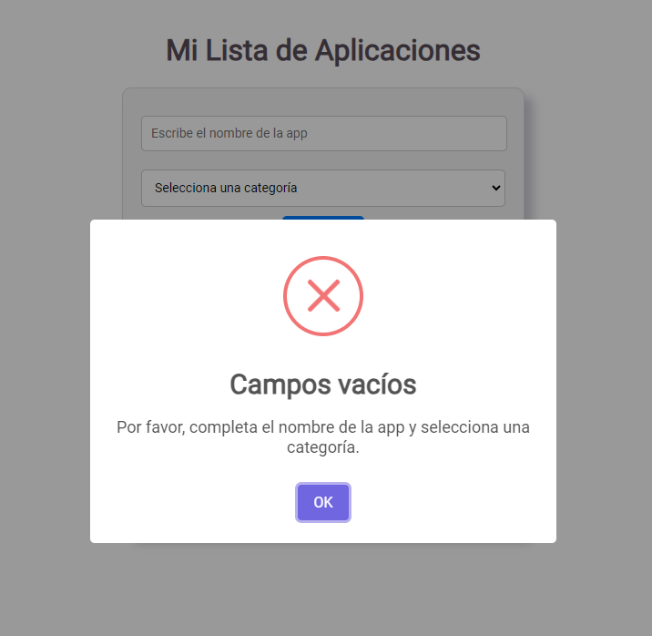
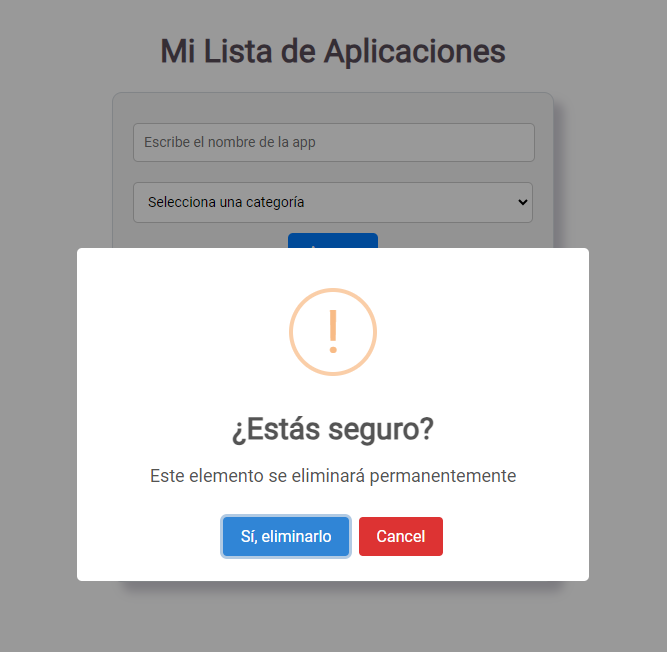

# Mi Lista de Aplicaciones

Este proyecto es una aplicación web simple creada con React que te permite administrar una lista de aplicaciones. Puedes agregar aplicaciones, seleccionar categorías y eliminar elementos de la lista. La aplicación también utiliza SweetAlert2 para mostrar ventanas emergentes con mensajes de confirmación y error.

## Cómo Funciona?

1. **Agregar Aplicaciones**:
   - Ingresa el nombre de la aplicación en el campo de entrada.
   - Selecciona una categoría para la aplicación desde las opciones proporcionadas en el menú desplegable.
   - Haz clic en el botón "Agregar" para incluir la aplicación en la lista.

2. **Eliminar Aplicaciones**:
   - Cada aplicación en la lista tiene un botón "Eliminar" representado por un icono de papelera. Puedes hacer clic en este botón para eliminar la aplicación correspondiente. Antes de eliminar, aparecerá una ventana emergente de confirmación.

3. **Validación de Entrada**:
   - La aplicación verifica si tanto el nombre de la aplicación como la categoría están completados antes de agregar una aplicación. Si alguno de los campos está vacío, aparecerá una ventana emergente de error.

## Tecnologías Utilizadas

- **React**: La interfaz de usuario se ha construido utilizando la biblioteca React.
- **SweetAlert2**: Se utiliza SweetAlert2 para mostrar ventanas emergentes con mensajes de error y confirmación.

## Ejecutar el Proyecto

1. Clona este repositorio en tu máquina local.
2. Abre una terminal en la ubicación del proyecto.
3. Ejecuta el comando `npm install` para instalar las dependencias necesarias.
4. Ejecuta el comando `npm start` para iniciar la aplicación en tu navegador.

## Capturas de Pantalla

Espero que esta información sea útil para entender cómo funciona el proyecto. Si tienes alguna pregunta o necesitas ayuda adicional, no dudes en contactarme
